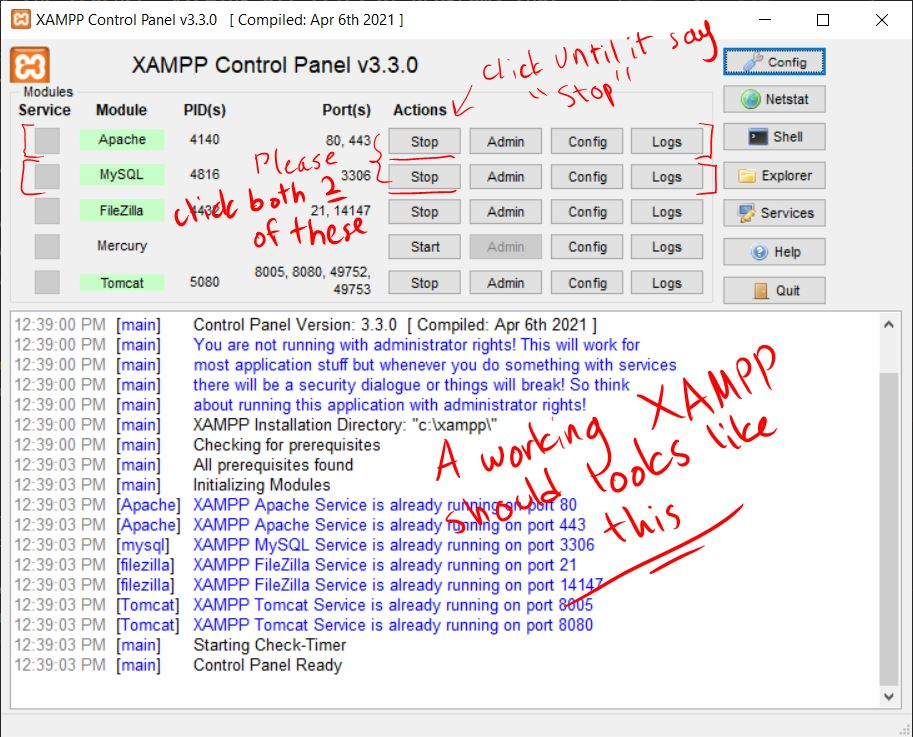
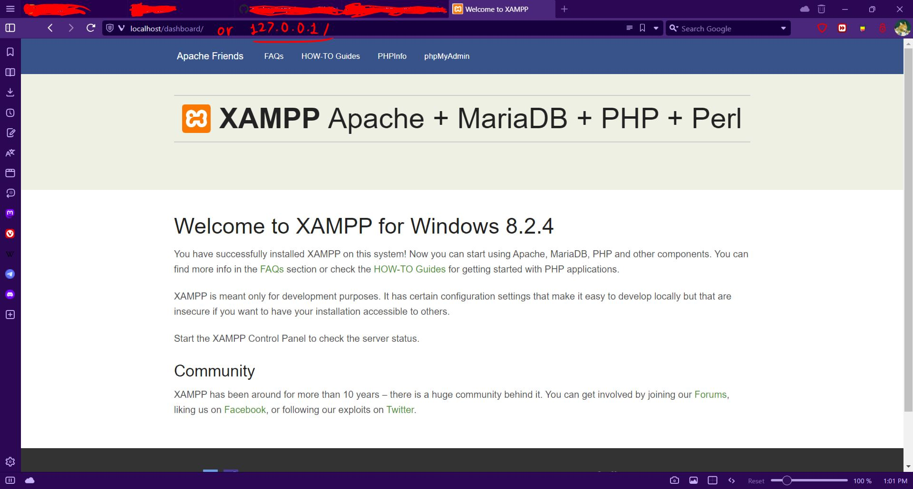
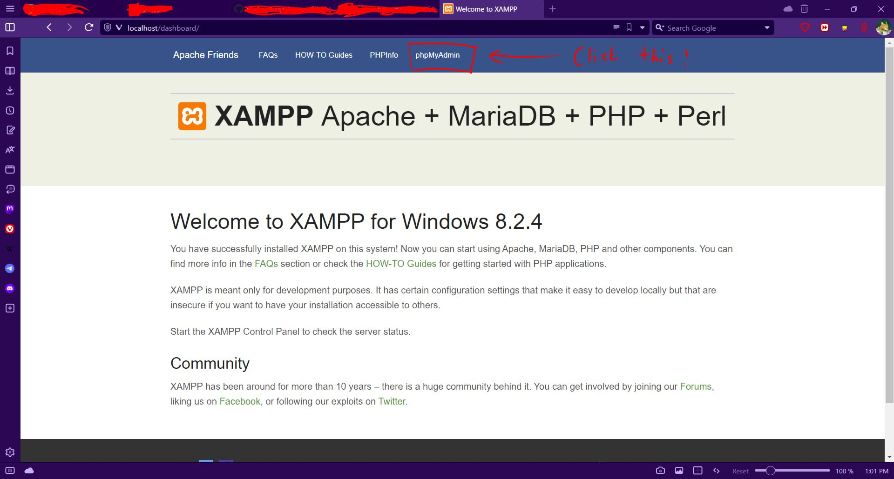
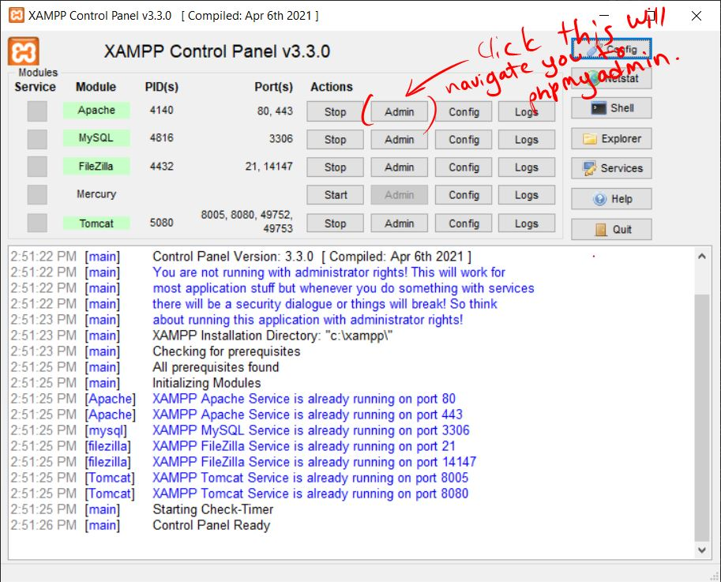
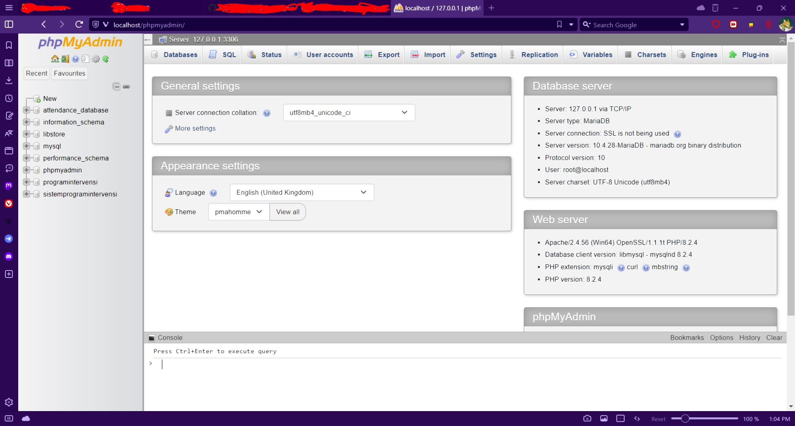

# TEMA TUGASAN SAINS KOMPUTER SPM 2024

## SISTEM REKOD KEHADIRAN : PENGESAHAN DIHUJUNG JARI

> **Rekod kehadiran individu merupakan maklumat penting bagi sesebuah organisasi sebagai bukti penglibatan atau kehadiran individu dalam setiap aktiviti yang dianjurkan. Perekodan kehadiran secara manual sering menyebabkan beberapa kesukaran seperti maklumat yang diperoleh kurang tepat, tercicir, bertindih, tidak jelas dan lain-lain. Sebagai seorang pembangun sistem, anda dikehendaki membangunkan satu aplikasi berasaskan web yang dapat merekod atau mengesahkan kehadiran individu dalam setiap aktiviti yang dianjurkan oleh organisasi. Sistem yang dibangunkan mestilah boleh dicapai menggunakan pelayar web dari mana-mana komputer dalam rangkaian setempat (LAN).**

## TEMA TUGASAN TAMAT

# SYSTEM

## Table Of Contents
- [Description](#description)
- [Installation](#installation)
- [Importing Database](#importing-database)

## From Dev
***Hello there, my name is Abas. I was a teenager when this README file was created and all of this system inside this repository. I created this repository to backup my code, because you will never know when the day is come and when the day have come you will desperately need it when it's not there. In this case I'm just affraid that I going to losing everything that I've build so hard. Anyway, if you see a commit that I had made which look like this `System update ver 17.8.2024 (adding some improvement and new features……) : 17/8/2024`, please ignore them, it look cringe to me because at this time I was not familliar with the concept of Semantic Version. The real initial version is Ver 1.0.0. Thank You, Danke and Terima Kasih.***

### Description
__Malay__: Sistem ini dengan nama "__Sistem Program Intervensi__" boleh melakukan perekodan kehadiran yang hanya boleh dilakukan oleh guru yang telah didaftarkan oleh admin (PKHEM) di dalam pangkalan data guru. Fungsi sistem yang diberi kepada guru termasuklah melihat senarai nama murid yang telah didaftarkan ke pangkalan data sistem, melihat kehadiran murid yang telah direkodkan oleh guru, melihat kesemua senarai program yang pernah diadakan, merekod kehadiran murid yang terlibat pada program tertentu dan mencetak senarai-senarai seperti kehadiran murid, murid yang pernah didaftarkan ke dalam pangkalan data dan senarai program sama ada yang tertentu mahupun kesemuanya.

__English__: This system with the name "__Intervention Program System__" can record attendance which can only be done by teachers who have been registered by the admin (PKHEM) in the teacher's database. The functions of the system given to the teacher include viewing the list of students' names that have been registered to the system database, viewing the attendance of students that have been recorded by the teacher, viewing all lists of programs that have been held, recording the attendance of students involved in certain programs and printing lists such as student attendance, students who have been registered in the database and the list of programs either specific or all.

### Installation

> [!NOTE]
> This installation guide is designed for beginners who are unfamiliar with server hosting.

1. **Basic Setup**
   - Ensure you have the following software installed on your computer:
     - [XAMPP Server](https://www.apachefriends.org/download.html)
     - [VS Code](https://code.visualstudio.com/download) or your preferred code editor.

2. **Starting Apache and MySQL**
   - Open the XAMPP Control Panel.
   - Start the Apache and MySQL services by clicking the "Start" button next to each module.

   

3. **Verify XAMPP is Running**
   - Open your web browser and go to `localhost/` or `127.0.0.1/`. You should see the Apache default page, confirming that the server is running.

   

4. **Access PhpMyAdmin**
   - Navigate to `localhost/phpmyadmin` or `127.0.0.1/phpmyadmin` in your browser, or click the "Admin" button in the XAMPP Control Panel.

   

   

5. **PhpMyAdmin Dashboard**
   - You should now see the PhpMyAdmin dashboard where you can manage your databases.

   

> [!TIP]
> If you encounter issues, consider:
>   - [Installing MySQL Manually](https://www.mysql.com/downloads/)
>   - Reinstalling XAMPP
>   - Restarting your computer
>   - Restarting Apache and MySQL services

> [!NOTE]
> For additional help, consult relevant online resources or use tools like ChatGPT for assistance.

### Importing Database

> [!IMPORTANT]
> Ensure that you start from the server tab, `Server: 127.0.0.1`, not from the `Database` or `Table` tabs.

1. Download the MySQL code to create the database and tables for the system. You can choose from the links below; both options will work:
   - [Database + tables](https://drive.google.com/drive/folders/17mYzm09Z2iTto87RjVU7fPn2zCUCwq5_?usp=sharing) only, no data included
   - [Database + tables + dummy data](https://drive.google.com/file/d/11H3kvz6VM49Ag_Avni7cltcJDmDrO4DE/view?usp=sharing), if you don't want to fill out the data manualy

2. After downloading, unzip the folder and you should get a file called `programintervensi.sql` or `programintervensi(empty set).sql` if you downloaded the first option, and make sure you know where the file's location is.

3. Open up "phpMyAdmin" and create a new database called `programintervensi`.

   

4. Copy and paste from the previously downloaded file (`programintervensi.sql`) and paste it into the text editor inside the page.

5. Click `GO` button.

6. After that, you should get a working database from that file.