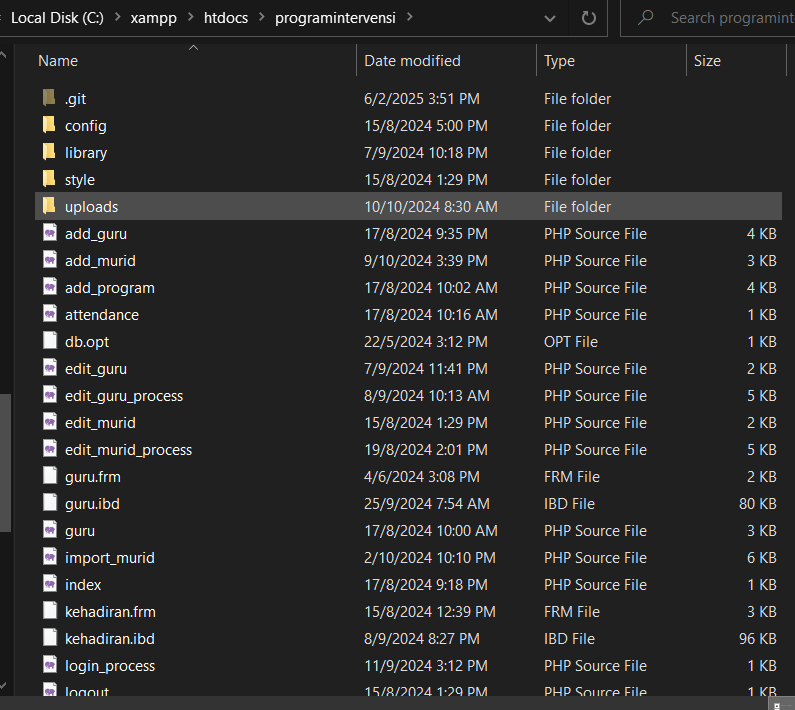

# TEMA TUGASAN SAINS KOMPUTER SPM 2024

## SISTEM REKOD KEHADIRAN : PENGESAHAN DIHUJUNG JARI

> **Rekod kehadiran individu merupakan maklumat penting bagi sesebuah organisasi sebagai bukti penglibatan atau kehadiran individu dalam setiap aktiviti yang dianjurkan. Perekodan kehadiran secara manual sering menyebabkan beberapa kesukaran seperti maklumat yang diperoleh kurang tepat, tercicir, bertindih, tidak jelas dan lain-lain. Sebagai seorang pembangun sistem, anda dikehendaki membangunkan satu aplikasi berasaskan web yang dapat merekod atau mengesahkan kehadiran individu dalam setiap aktiviti yang dianjurkan oleh organisasi. Sistem yang dibangunkan mestilah boleh dicapai menggunakan pelayar web dari mana-mana komputer dalam rangkaian setempat (LAN).**

## TEMA TUGASAN TAMAT

# SYSTEM

## Table Of Contents
- [Description](#description)
- [Installation](#installation)
- [Importing Database](#importing-database)

## From Dev
***Hello there, my name is Abas. I was a teenager when this README file was created and all of this system inside this repository. I created this repository to backup my code, because you will never know when the day is come and when the day have come you will desperately need it when it's not there. In this case I'm just affraid that I going to losing everything that I've build so hard. Anyway, if you see a commit that I had made which look like this `System update ver 17.8.2024 (adding some improvement and new features……) : 17/8/2024`, please ignore them, it look cringe to me because at this time I was not familliar with the concept of Semantic Version. The real initial version is Ver 1.0.0. Thank You, Danke and Terima Kasih.***

### Description
__Malay__: Sistem ini dengan nama "__Sistem Program Intervensi__" boleh melakukan perekodan kehadiran yang hanya boleh dilakukan oleh guru yang telah didaftarkan oleh admin (PKHEM) di dalam pangkalan data guru. Fungsi sistem yang diberi kepada guru termasuklah melihat senarai nama murid yang telah didaftarkan ke pangkalan data sistem, melihat kehadiran murid yang telah direkodkan oleh guru, melihat kesemua senarai program yang pernah diadakan, merekod kehadiran murid yang terlibat pada program tertentu dan mencetak senarai-senarai seperti kehadiran murid, murid yang pernah didaftarkan ke dalam pangkalan data dan senarai program sama ada yang tertentu mahupun kesemuanya.

__English__: This system with the name "__Intervention Program System__" can record attendance which can only be done by teachers who have been registered by the admin (PKHEM) in the teacher's database. The functions of the system given to the teacher include viewing the list of students' names that have been registered to the system database, viewing the attendance of students that have been recorded by the teacher, viewing all lists of programs that have been held, recording the attendance of students involved in certain programs and printing lists such as student attendance, students who have been registered in the database and the list of programs either specific or all.

### Installation

> [!NOTE]
> This installation guide is designed for beginners who are unfamiliar with server hosting.

1. **Basic Setup**
   - Ensure you have the following software installed on your computer:
     - [XAMPP Server](https://www.apachefriends.org/download.html)
     - [Git](https://git-scm.com/downloads)
     - [VS Code](https://code.visualstudio.com/download) or your preferred code editor.

2. **Starting Apache and MySQL**
   - Open the XAMPP Control Panel.
   - Start the Apache and MySQL services by clicking the "Start" button next to each module.

   

3. **Verify XAMPP is Running**
   - Open your web browser and go to `localhost/` or `127.0.0.1/`. You should see the Apache default page, confirming that the server is running.

   

4. **Access PhpMyAdmin**
   - Navigate to `localhost/phpmyadmin` or `127.0.0.1/phpmyadmin` in your browser, or click the "Admin" button in the XAMPP Control Panel.

   

   

5. **PhpMyAdmin Dashboard**
   - You should now see the PhpMyAdmin dashboard where you can manage your databases.

   

> [!TIP]
> If you encounter issues, consider:
>   - [Installing MySQL Manually](https://www.mysql.com/downloads/)
>   - Reinstalling XAMPP
>   - Restarting your computer
>   - Restarting Apache and MySQL services

> [!NOTE]
> For additional help, consult relevant online resources or use tools like ChatGPT for assistance.

### Importing Database

> [!IMPORTANT]
> Ensure that you start from the server tab, `Server: 127.0.0.1`, not from the `Database` or `Table` tabs.

1. Download the MySQL code to create the database and tables for the system. You can choose from the links below; both options will work:
   - [Database + tables](https://drive.google.com/drive/folders/1JEOnP4o7q0R7AASYBMLtnpjmTSWZGplK?usp=drive_link) only, no data included
   - [Database + tables + dummy data](https://drive.google.com/drive/folders/1JEOnP4o7q0R7AASYBMLtnpjmTSWZGplK?usp=drive_link), if you don't want to fill out the data manualy

2. After downloading, unzip the folder and you should get a file called `programintervensi.sql` or `programintervensi(empty set).sql` if you downloaded the first option, and make sure you know where the file's location is.

3. Open up "phpMyAdmin" and create a new database called `programintervensi`.

   

4. Copy and paste from the previously downloaded file (`programintervensi.sql`) and paste it into the text editor inside the page.

5. Click `GO` button.

6. After that, you should get a working database from that file.

### Importing System

> [!IMPORTANT]
> Before you can start, please make sure XAMPP is working and running fine as well as MySQL (_Which also need to be start using the XAMPP control panel_).

1. Navigate to `htdocs` folder which usually located at XAMPP directory(_please refer to your system since different OS locate XAMPP on different folder path and name_), XAMPP use this folder to store every system project that you create and run it from here (_Which can be access using your web browser by navigate to this link `localhost/<your_system_folder>`_).

2. Make sure you had Git installed in your computer already, you must use __Command Prompt__(_Windows_) or __Windows Terminal__(_Windows_) / __Terminal__(_Mac_/_Linux_) to run Git since it only works by running a command line.

3. After opening your computer terminal, make sure you navigate to `htdocs` folder using your terminal or by opening a terminal inside `htdocs` by __right-click__ and select Open Terminal(_if avaliable_).

4. Run this command, `git clone https://github.com/cgabas/kerja_kursus_SK_batch_07.git programintervensi`.

5. The cloning process should look like this:

6. After the cloning process is successful, you should be able to see a new folder call `programintervensi`. By clicking on it, you should see a full system files inside of the folder itself like the one you saw in this page.

7. After that, open any web browser you had and type in `localhost/programintervensi` on your link bar(_Make sure XAMPP is always open during this process_).

8. By that, you should see this page display at your browser:

> ![IMPORTANT]
> With XAMPP running, This system should be working as long as the MySQL(_For the database_) and Apache(_To run the system itself_) is turn on.

> ![NOTE]
> If you recieved an error when you about to launch the system page, please consider to:
> 1. Update your PHP version since there is some new version library in that system that required a new version of PHP. Visit back `https://www.apachefriends.org/download.html` where you downloaded XAMPP in the first place and install the XAMPP that has PHP 8.1.x version and above.
> 2. Please refer to online resource to help you with any error that occur during system import.

## Good Luck Trying!
### From __*Abas 2024/2025*__